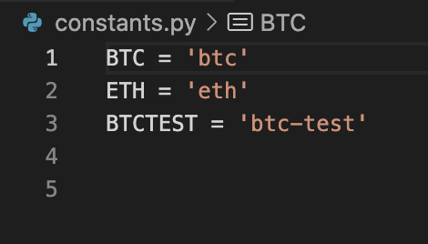
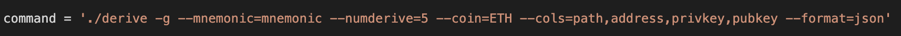

# UWFT-blockchain-python
UWFT Unit 19 Homework 

# Create your own wallet 

## Background
*excerpt from student guide* 

Your new startup is focusing on building a portfolio management system that supports not only traditional assets
like gold, silver, stocks, etc, but crypto-assets as well! The problem is, there are so many coins out there! It's
a good thing you understand how HD wallets work, since you'll need to build out a system that can create them.

You're in a race to get to the market. There aren't as many tools available in Python for this sort of thing, yet.
Thankfully, you've found a command line tool, `hd-wallet-derive` that supports not only BIP32, BIP39, and BIP44, but
also supports non-standard derivation paths for the most popular wallets out there today! However, you need to integrate
the script into your backend with your dear old friend, Python.

Once you've integrated this "universal" wallet, you can begin to manage billions of addresses across 300+ coins, giving
you a serious edge against the competition.

In this assignment, however, you will only need to get 2 coins working: Ethereum and Bitcoin Testnet.
Ethereum keys are the same format on any network, so the Ethereum keys should work with your custom networks or testnets.

## Dependencies

- Install PHP 
- You will need to clone the [`hd-wallet-derive`](https://github.com/dan-da/hd-wallet-derive) tool.
- [`bit`](https://ofek.github.io/bit/) Python Bitcoin library.
- [`web3.py`](https://github.com/ethereum/web3.py) Python Ethereum library.

### Project setup

- Created a local directory called wallet. 

- Clone the `hd-wallet-derive` tool into this folder and install it using the instructions on its `README.md`.

- Created a link with ln to shorten the code needed to enable hd-wallet derive. Termed it *derive* 

- Create a file called `wallet.py` -- this had pre-populated content from a starter file. 

### Setup constants

- In a separate file, `constants.py`, added the following: 
  - `BTC = 'btc'`
  - `ETH = 'eth'`
  - `BTCTEST = 'btc-test'`

- In `wallet.py`, import all constants: `from constants import *`

### Setup Mnemonic 
- Created new mnemonic for this assignement. 
- Saved it as an environmental variable, called "MNEMONIC-HW" 
- Used dotenv library to call the mnemonic. 

### Setup Mnemonic 
- Tested out getting keys and addresses using a variable called "command" 
